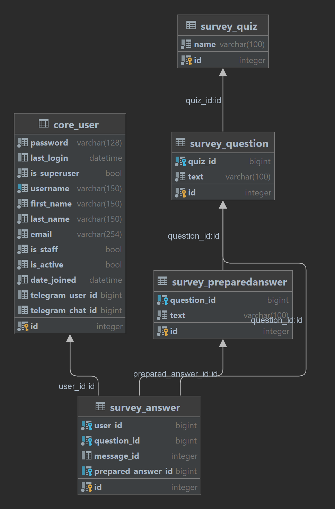

## Первое задание.
Сначала хотел сделать оба задания, но по причинам, описанным абзацем ниже выполнял только второе.

OpenAI - не работает в РФ. Не дает ключи по номеру телефона РФ. Нет бесплатного варианта использования.

## Второе задание
### Особенности

1) При попытке пользователя пройти уже пройденный опрос, старые ответы удаляются перед началом перепрохождения опроса.
2) Выбрана БД SQLite так как проект достаточно простой.
3) Ответы на вопросы с выбором ответа сохраняются не со ссылкой на сообщение пользователя, так как его нет, а со ссылкой на выбранный ответ.
4) Часть кода взял у себя из [*проекта*](https://github.com/Radislav123/wildberries_parser_1.git).
5) После ответа на вопрос сам вопрос и ответ на него удаляются для того, чтобы выдержать единый стиль у двух типов вопросов. Другим вариантом была отправка
   сообщения пользователю с выбранным ответом при ответе на вопрос с выбором, но такой вариант не был выбран из-за личных предпочтений.
6) Для запуска проекта необходимы заполненные [*секреты*](secrets). Их можно запросить у владельца репозитория.
7) Схема БД без таблиц Django:

   


## Установка
Инструкции даны для Windows, где есть платформозависимая специфика.

1) Скачать [*проект*](https://github.com/Radislav123/teleeng_intern_task.git)
   ```shell
   git clone https://github.com/Radislav123/teleeng_intern_task.git
   ```
    1) Перейти в корень проекта
       ```shell
       cd teleeng_intern_task
       ```
2) Установить [*python 3.11*](https://www.python.org/downloads/release/python-3119/)
    1) Создать виртуальное окружение
       ```shell
       python -m venv venv
       ```
    2) Активировать окружение
       ```shell
       venv\Scripts\activate
       ```
3) Установить зависимости
   ```shell
   pip install -r requirements.txt
   ```
4) Запросить [*секреты*](secrets) у владельца репозитория.
    1) Папка [*secrets*](secrets) должна быть в корне репозитория.
5) Подготовить БД
   ```shell
   python manage.py makemigrations core survey telegram_bot
   python manage.py migrate
   python manage.py create_special_users
   python manage.py recreate_quizzes
   ```


## Проверка
### Бот
[*Ссылка*](https://t.me/teleeng_intern_task_bot)

#### Запуск

```shell
python manage.py run_telegram_bot
```

### Панель администратора
Для входа в панель администратора можно использовать данные, записанные в [*секретах*](secrets/admin_panel/admin_user.json).

#### Запуск
[*Ссылка*](http://127.0.0.1:8000/admin/)

```shell
python manage.py runserver
```

### Изменение опросов
Опросы можно изменить двумя способами:

1) Через панель администратора
2) Через json-файл
    1) Изменить файл [*quizzes.json*](resources/survey/quizzes.json) в соответствии с необходимой структурой опросов.
    2) Выполнить
       ```shell
       python manage.py recreate_quizzes
       ```
